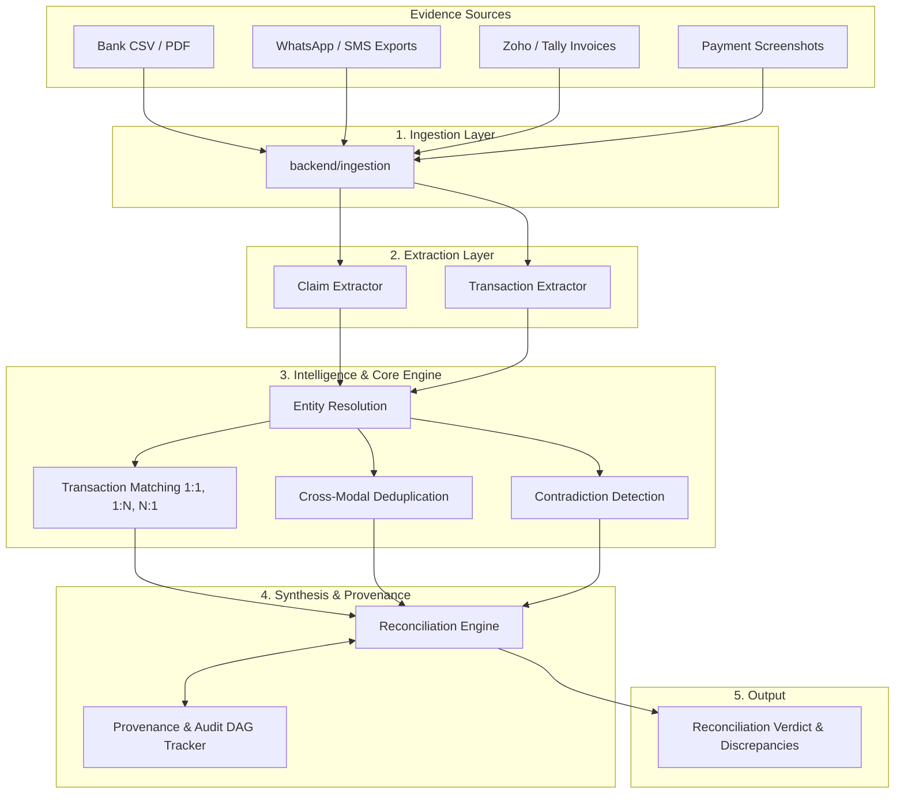

# VERITY System Architecture

**VERITY — Financial Truth, Reconstructed**
*Razorpay AI Buildathon 2026 | Track: AI Finance Controller*

---

## 1. Architectural Philosophy & Principles

VERITY is built as a **modular monolith** optimized for determinism, auditability, strong typing, and extensible multimodal AI extraction.

### Core Tenets:
1. **Evidence ≠ Claim ≠ Conclusion**:
   - **Evidence**: The raw, uninterpreted artifact captured from the real world (CSV row, WhatsApp message text, image OCR, PDF invoice).
   - **Claim**: A semantic financial assertion made inside an evidence artifact (*"I sent ₹25,000 via GPay"* or *"Invoice due: ₹50,000"*).
   - **Conclusion (Reconciliation)**: The synthesized truth reached by verifying claims against immutable bank/gateway ledgers.
2. **Immutable Cryptographic Provenance**:
   - Every financial conclusion can be traced back through a Directed Acyclic Graph (DAG) of SHA-256 fingerprinted provenance nodes to the exact raw evidence inputs and extraction rules.
3. **Explicit Handling of Uncertainty & Contradictions**:
   - Rather than forcing ambiguous or conflicting data into false certainty, VERITY tags conclusions as `CONFIRMED`, `PARTIAL`, `DUPLICATE`, `CONTRADICTED`, `UNVERIFIABLE`, or `AMBIGUOUS`.
4. **Separation of Deterministic Calculations from AI Inference**:
   - Ledger math, cryptographic hashing, and transaction aggregation remain strictly deterministic and auditable. AI extraction plugs in as an upstream parser.

---

## 2. Subsystem Boundaries

### Module Responsibilities:

| Module | Responsibility |
|---|---|
| `backend.domain` | Strongly typed canonical models (`Evidence`, `Claim`, `Entity`, `Transaction`, `Discrepancy`, `ReconciliationRecord`, `ProvenanceNode`). |
| `backend.ingestion` | Ingests heterogeneous files and feeds into normalized `Evidence` objects with SHA-256 content hashes. |
| `backend.extraction` | Transforms raw `Evidence` into semantic `Claim` objects and verified `Transaction` ledger records. |
| `backend.entity_resolution` | Matches names, trading styles, GSTIN, PAN, UPI VPAs, and phone numbers to canonical entities. |
| `backend.transaction_matching` | Pairs claims and transactions across 1:1, 1:N (bulk settlements), and N:1 (milestone installments). |
| `backend.deduplication` | Detects redundant evidence across modalities (e.g. UPI screenshot + Bank statement line) to prevent double-counting. |
| `backend.contradiction_detection` | Identifies conflicts between claimed amounts and ledger facts (e.g. client claims 50k sent, bank records 35k or bounce). |
| `backend.provenance` | Maintains the tamper-evident DAG linking every reconciliation result back to root evidence artifacts. |
| `backend.reconciliation` | Orchestrates the pipeline and synthesizes the final verified financial conclusions. |

---

## 3. Technology Stack

- **Language**: Python 3.10+ (tested on Python 3.14)
- **Data Validation & Schemas**: Pydantic v2
- **Testing & Verification**: Pytest 9.x
- **Hashing**: SHA-256 cryptographic digests
- **Architecture**: Modular Monolith (No microservices, no unnecessary frameworks)
