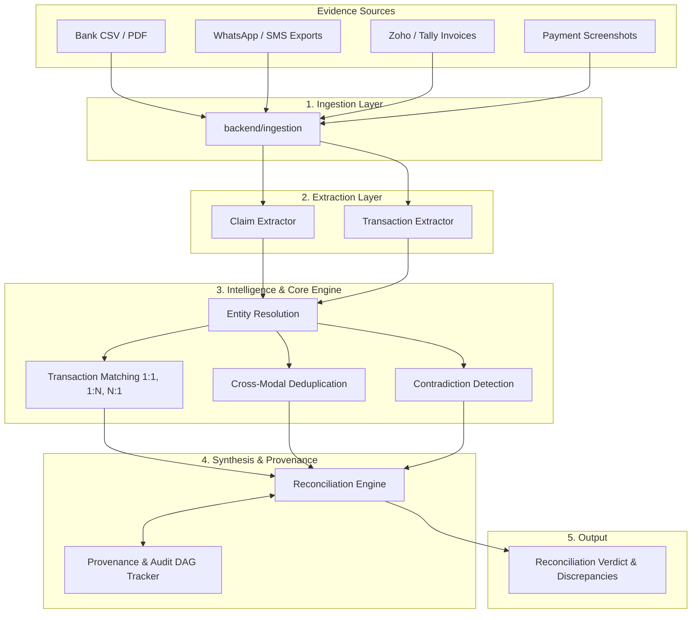

# VERITY System Architecture

**VERITY — Financial Truth, Reconstructed**
*Razorpay AI Buildathon 2026 | Track: AI Finance Controller*

---

## 1. Architectural Philosophy & Principles

VERITY is built as a **modular monolith** optimized for determinism, auditability, strong typing, and extensible multimodal AI extraction.

### Core Tenets:
1. **Evidence ≠ Claim ≠ Conclusion**:
   - **Evidence**: The raw, uninterpreted artifact captured from the real world (CSV row, WhatsApp message text, image OCR, PDF invoice).
   - **Claim**: A semantic financial assertion made inside an evidence artifact (*"I sent ₹25,000 via GPay"* or *"Invoice due: ₹50,000"*).
   - **Conclusion (Reconciliation)**: The synthesized truth reached by verifying claims against immutable bank/gateway ledgers.
2. **Immutable Cryptographic Provenance**:
   - Every financial conclusion can be traced back through a Directed Acyclic Graph (DAG) of SHA-256 fingerprinted provenance nodes to the exact raw evidence inputs and extraction rules.
3. **Explicit Handling of Uncertainty & Contradictions**:
   - Rather than forcing ambiguous or conflicting data into false certainty, VERITY tags conclusions as `CONFIRMED`, `PARTIAL`, `DUPLICATE`, `CONTRADICTED`, `UNVERIFIABLE`, or `AMBIGUOUS`.
4. **Separation of Deterministic Calculations from AI Inference**:
   - Ledger math, cryptographic hashing, and transaction aggregation remain strictly deterministic and auditable. AI extraction plugs in as an upstream parser.

---

## 2. Subsystem Boundaries

### Module Responsibilities:

| Module | Responsibility |
|---|---|
| `backend.domain` | Strongly typed canonical models (`Evidence`, `Claim`, `Entity`, `Transaction`, `Discrepancy`, `ReconciliationRecord`, `ProvenanceNode`). |
| `backend.ingestion` | Ingests heterogeneous files (CSV, TXT, PDF, PNG/JPG/WEBP) via modular adapters (`BankCSVAdapter`, `TextMessageAdapter`, `PDFDocumentAdapter`, `ImagePaymentScreenshotAdapter`) and `IngestionService` into normalized `Evidence` objects with SHA-256 content hashes. |
| `backend.extraction` | Transforms raw `Evidence` into structured `Claim` objects via deterministic parsers (`BankCSVExtractor`, `TextClaimExtractor` with relative date resolution, `PDFDocumentExtractor`) and provider-independent multimodal AI extractors (`AIExtractionProvider`, `ExtractionService`) supporting Google Gemini (`google-genai`) VLM vision processing and strict anti-hallucination safeguards. |
| `backend.entity_resolution` | Resolves extracted `Claim` counterparty hints against known `Entity` records via multi-signal scoring (`GSTIN`, `PAN`, `UPI VPA`, phone, aliases, initials) with strict ambiguity preservation and zero false merges. |
| `backend.transaction_matching` | Establishes candidate `MatchRelationship` records across 1:1, 1:N (bulk settlements), N:1 (milestone installments), Partial, Ambiguous, and Conflicting topologies with bounded combination search and zero false matches. |
| `backend.deduplication` | Non-destructively clusters multimodal evidence (Bank statements, WhatsApp, Screenshots, Invoices) into canonical `DeduplicationGroup` objects, detecting cryptographic content duplicates (`DUPLICATE_EVIDENCE_CONTENT`) and event-level duplicates (`SAME_EVENT`) while preserving distinct transactions (`DISTINCT_EVENT`). |
| `backend.contradiction_detection` | Identifies and structures deterministic disagreements (`Discrepancy`) across amounts, explicit references (UTR/RRN), counterparty identities, dates, directions, and claims without prematurely deciding which source is correct. |
| `backend.provenance` | Maintains the tamper-evident DAG linking every reconciliation result back to root evidence artifacts. |
| `backend.reconciliation` | Synthesizes verified financial reconciliation conclusions (`CONFIRMED`, `PARTIALLY_SETTLED`, `CONTRADICTED`, `UNVERIFIABLE`, `AMBIGUOUS`, `UNMATCHED`) across Days 1–7 outputs with deterministic rules, zero double-counting, and monetary invariant enforcement. |
| `backend.reporting` | Generates explainable, deterministic Financial Truth Reports (`FinancialTruthReport`) with human-readable justifications, factor breakdowns, recommended review actions, and complete provenance traceability. |
| `backend.controller` | Intelligent decision-support layer: risk classification (`ControllerRiskLevel`), primary action directives (`ControllerActionType`), action prioritization, and fact-checking AI explainer with strict zero-hallucination safeguards. |
| `backend.review` | Human review and case investigation subsystem: finite state workflow machine, append-only review notes, evidence inspection tracking, non-destructive decision recording, and tamper-evident SHA-256 hash-chained audit logging. |
| `backend.portfolio` | Financial Case Portfolio & Operations Intelligence subsystem: portfolio aggregation, zero double-counting exposure synthesis, SLA deadline and health tracking, reviewer assignment, workload & overload analytics, and multi-factor prioritization scoring. |
| `backend.storage` | Persistent Storage, Repository Layer & Durable Audit Infrastructure (Day 16): 18 strongly typed SQL tables, atomic transactions with savepoint rollback, SHA-256 hash-chained audit store with tamper detection, and restart-safe operational recovery. |
| `backend.cross_case` | Cross-Case Intelligence & Counterparty Memory Subsystem (Day 18): SQL-backed institutional memory across cases, lifetime counterparty volume & dispute tracking, duplicate reference / UTR reuse detection, recurring discrepancy pattern recognition, deterministic case correlation, and historical risk alerting. |
| `backend.controller.remediation` | Proactive Controller Actions & Remediation Subsystem (Day 19): Fact-grounded dispute notices, payment reminders, missing evidence requests, deterministic balanced draft double-entry journal vouchers, strict human approval boundary, and immutable audit event logging. |
| `backend.config` | Typed configuration management with environment variable overrides (`Settings`, `StorageSettings`), AI provider settings (`VERITY_AI_PROVIDER`, `VERITY_AI_MODEL`), and resource limits. |
| `backend.api` | Production-ready FastAPI REST layer exposing endpoints with Request-ID propagation, defensive security headers, CORS origin restrictions, and structured error handlers. |
| `backend.api.security` | Defensive input validation: filename sanitization (path traversal prevention), MIME type whitelisting, upload size validation, and complexity bounds. |
| `frontend` | Interactive Financial Truth Controller dashboard featuring glassmorphic dark UI, 8-stage telemetry, AI controller intelligence, Human Review workspace, Case Portfolio console, and 10 one-click benchmark scenarios. |

---

## 3. Technology Stack

- **Language**: Python 3.10+ (tested on Python 3.14)
- **Data Validation & Schemas**: Pydantic v2
- **Multimodal AI / VLM**: `google-genai` (Gemini 2.0 Flash) & OpenAI-compatible vision
- **Document & Image Processing**: `pypdf`, `Pillow` (PIL)
- **Persistent Storage**: SQLAlchemy 2.0, SQLite (WAL mode, foreign keys, ACID transactions)
- **Testing & Verification**: Pytest 9.x
- **Hashing**: SHA-256 cryptographic digests
- **Architecture**: Modular Monolith (No microservices, no unnecessary frameworks)

