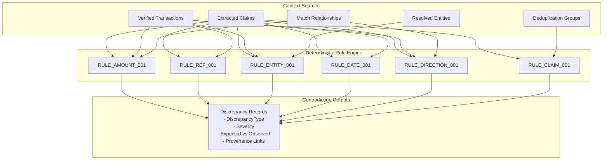

# VERITY Contradiction Detection Subsystem

**Day 7 Milestone: Deterministic Contradiction & Discrepancy Detection**  
*Razorpay AI Buildathon 2026 | Track: AI Finance Controller*

---

## 1. Core Principles & Philosophy

The Contradiction Detection subsystem identifies and structures disagreements across heterogeneous evidence, claims, transactions, entities, and deduplication groups.

### 🔒 Core Invariant: Detect Disagreement $\neq$ Resolve Disagreement
$$\mathbf{Evidence \to Claim \to Entity \to Match\ Relationship \to Deduplication\ Group \to Discrepancy \to Future\ Reconciliation}$$

1. **Detect Disagreement Without Choosing Sides**:
   - Day 7 answers *"Where does the evidence disagree?"*
   - It strictly does **NOT** decide *"Which side is financially correct?"* (Resolution belongs to Day 8 Reconciliation).
2. **Zero False Contradiction Policy**:
   - Valid partial payments (`PARTIAL`) are recognized and suppressed from false `AMOUNT_MISMATCH` alerts.
   - Normal settlement delays ($\le \text{date\_tolerance}$) are suppressed from `DATE_MISMATCH` alerts.
   - GPay vs UPI payment rails are recognized as compatible and suppressed from false conflicts.
   - Multilingual equivalent claims ("20k GPay kar diya" vs "₹20,000 sent") are normalized without discrepancy.
   - Missing amounts (`claimed_amount: None`) are recognized as absence of information, not amount contradictions.
3. **Traceability & Provenance**:
   - Every `Discrepancy` links directly to its source `Evidence`, `Claim`, `Transaction`, and `Entity` IDs through the tamper-evident provenance DAG.

---

## 2. Contradiction Taxonomy & Severity Matrix

| Discrepancy Type | Default Severity | Description |
|---|---|---|
| `AMOUNT_MISMATCH` | `ERROR` | Invoiced / claimed amount contradicts bank settlement amount (not explained by partial payment). |
| `REFERENCE_MISMATCH` | `ERROR` | Conflicting explicit UTR / RRN numbers cited for the same event (e.g. `408219381920` vs `999888777666`). |
| `ENTITY_MISMATCH` | `CRITICAL` | Disagreement between claim's resolved counterparty entity and bank ledger entity. |
| `DATE_MISMATCH` | `WARNING` | Settlement date drift exceeds configurable acceptable window ($> 30$ days). |
| `DIRECTION_MISMATCH` | `CRITICAL` | Declared fund flow contradicts ledger direction (e.g. Inflow credit claimed as outflow debit). |
| `CONFLICTING_CLAIMS` | `ERROR` | Multiple conflicting claims asserted for the same event group (e.g. Claim A ₹20k vs Claim B ₹25k). |
| `PAYMENT_RAIL_MISMATCH` | `WARNING` | Conflicting payment rail assertions (e.g. Cash voucher claimed vs RTGS ledger). |
| `PARTIAL_SETTLEMENT` | `INFO` | Informational notice for valid partial installment payments. |
| `MISSING_EVIDENCE` | `WARNING` | Unsubstantiated claims lacking corresponding ledger records. |

---

## 3. Architecture & Execution Flow



---

## 4. API Usage Example

```python
from backend.contradiction_detection import ContradictionDetector, ContradictionConfig

detector = ContradictionDetector(config=ContradictionConfig(max_acceptable_date_drift_days=30))

result = detector.detect(
    claims=claims,
    transactions=transactions,
    deduplication_groups=deduplication_groups,
    match_relationships=match_relationships,
    claim_entity_map=entity_map,
)

print(f"Total Contradictions: {result.total_contradictions}")
for disc in result.discrepancies:
    print(f"[{disc.severity.value}] {disc.discrepancy_type.value}: {disc.message}")
    print(f"  Expected: {disc.expected_value} | Observed: {disc.observed_value}")
```
