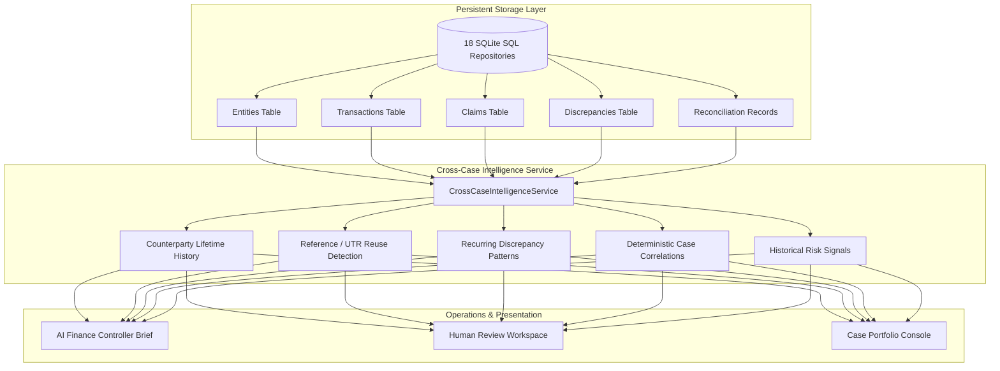

# VERITY Cross-Case Intelligence & Counterparty Memory (Day 18)

## 1. Overview & Architectural Purpose

VERITY's **Cross-Case Intelligence & Counterparty Memory** subsystem endows the AI Finance Controller with durable institutional memory across historical financial cases.

While individual financial cases are reconciled deterministically in strict isolation, enterprise controllership requires understanding:
* **Counterparty History**: Have we transacted with this vendor or customer before? What is their lifetime transaction volume and dispute frequency?
* **Reference & UTR Reuse**: Has this bank UTR, cheque number, or transaction reference appeared in another case?
* **Recurring Discrepancies**: Does this counterparty exhibit repeated discrepancy patterns (e.g. consistent GST mismatch or unlinked bank credits)?
* **Case Correlations**: What historical cases are deterministically linked to the current investigation?
* **Historical Risk Alerts**: What objective, explainable risk signals should be surfaced to the controller?



---

## 2. Core Safety Invariants

1. **Authoritative Deterministic Truth**:
   Cross-case intelligence is contextual metadata. It **MUST NEVER** alter reconciliation status, matched amounts, outstanding balances, or ledger transactions.
2. **Zero Cross-Case Pollution**:
   Financial reconciliation for Case $B$ relies strictly on objective evidence within Case $B$. Historical anomalies in Case $A$ surface as contextual warnings for human operators, but never corrupt Case $B$'s mathematical truth.
3. **Deterministic Derivations Only**:
   All metrics, case counts, exposure sums, and correlation links are derived directly from indexed SQL records via parameterized queries. Zero LLMs participate in arithmetic or correlation calculations.
4. **No Additional Databases**:
   Implemented entirely on top of the existing SQLite storage engine with zero external dependencies (no Neo4j, no vector embeddings).

---

## 3. Domain Models (`backend/cross_case/models.py`)

### `CounterpartyHistory`
* `entity_id`: Canonical entity ID
* `canonical_name`: Canonical business name
* `aliases`: Known trade aliases
* `case_count`: Number of historical cases involving entity
* `total_exposure`: Lifetime expected/matched financial volume (INR)
* `disputed_exposure`: Cumulative volume in CONTRADICTED cases (INR)
* `unresolved_exposure`: Cumulative outstanding balance across cases (INR)
* `contradiction_count`: Number of past contradictory cases
* `previous_case_ids`: Associated case IDs
* `historical_risk_signals`: Explainable deterministic risk warnings

### `ReferenceCorrelation`
* `reference_id`: Bank UTR, RRN, or reference ID
* `current_case_id`: Context case ID
* `previous_case_ids`: All cases citing this reference
* `transaction_ids`: Linked bank transaction IDs
* `claim_ids`: Linked claim IDs
* `occurrence_count`: Distinct case count
* `reuse_warning`: True if reference appears in $>1$ distinct case

### `RecurringDiscrepancyPattern`
* `entity_name`: Target entity name
* `discrepancy_type`: Category (e.g. `AMOUNT_MISMATCH`)
* `occurrence_count`: Frequency across history
* `affected_case_ids`: Case IDs containing the discrepancy
* `total_affected_exposure`: Combined monetary exposure

### `CrossCaseCorrelation`
* `current_case_id`: Target case ID
* `related_case_id`: Historical case ID
* `relationship_type`: `SHARED_ENTITY`, `SHARED_REFERENCE`, `RECURRING_DISCREPANCY`, `SHARED_EVIDENCE_HASH`
* `shared_identifier`: Shared entity, UTR, or hash
* `deterministic_reason`: Human-verifiable explanation
* `supporting_ids`: Matching entity, transaction, or claim IDs

---

## 4. API Endpoints

| Method | Path | Description |
|:---|:---|:---|
| `GET` | `/api/v1/entities/{id_or_name}/history` | Counterparty lifetime case count, volume, and dispute history |
| `GET` | `/api/v1/entities/{id_or_name}/exposure` | Monetary exposure breakdown for counterparty |
| `GET` | `/api/v1/references/{reference_id}/history` | Duplicate UTR / reference reuse detection across cases |
| `GET` | `/api/v1/cases/{case_id}/correlations` | Deterministic links between case and historical cases |
| `GET` | `/api/v1/cases/{case_id}/historical-signals` | Explainable historical risk signals for controller |
| `GET` | `/api/v1/cases/{case_id}/intelligence-profile` | Complete unified cross-case intelligence dossier |

---

## 5. Verification & Testing

```bash
# Run Day 18 Cross-Case Evaluator (12 / 12 Scenarios)
python scripts/evaluate_cross_case.py

# Run Unit Tests
python -m pytest tests/unit/cross_case/ -v
```
