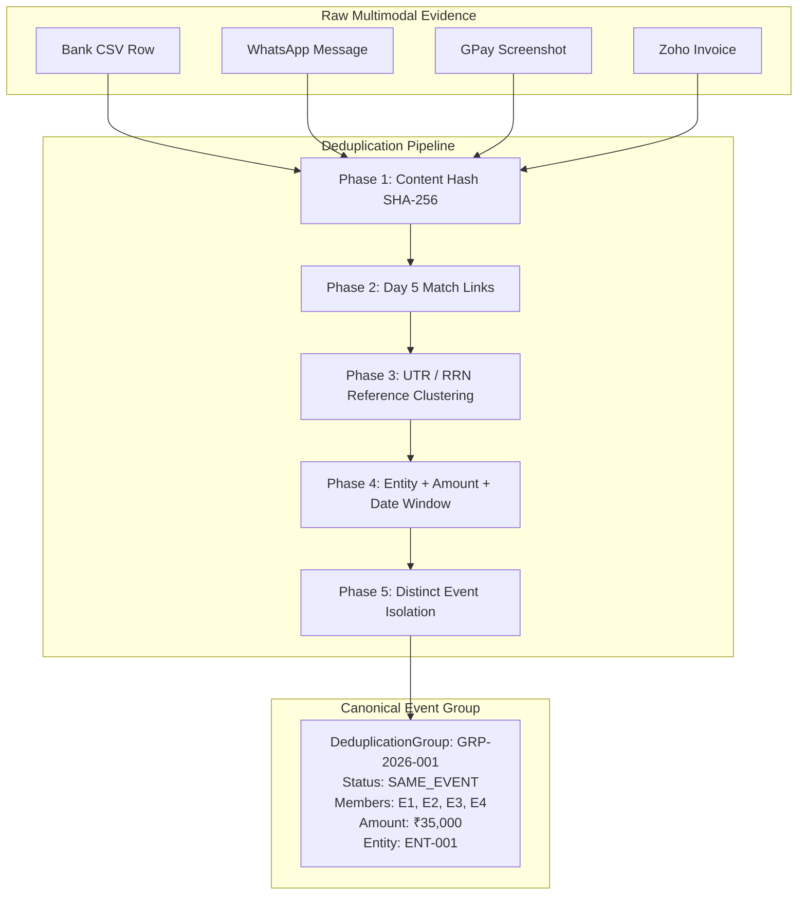

# VERITY Cross-Modal Deduplication Subsystem

**Day 6 Milestone: Deterministic Cross-Modal Evidence Deduplication & Event Grouping**  
*Razorpay AI Buildathon 2026 | Track: AI Finance Controller*

---

## 1. Core Principles & Philosophy

The Cross-Modal Deduplication subsystem groups heterogeneous evidence artifacts (Bank statements, invoices, payment screenshots, WhatsApp chats) that describe the **same underlying financial event** without destroying original evidence or collapsing distinct transactions.

### 🔒 Core Invariant: Duplicate Evidence $\neq$ Duplicate Transaction
$$\mathbf{Evidence \to Claim \to Entity \to Match\ Relationship \to Deduplication\ Event\ Group}$$

1. **Non-Destructive Grouping**:
   - Deduplication never physically deletes or mutates raw `Evidence` artifacts.
   - Creates a lightweight `DeduplicationGroup` container maintaining references to all contributing evidence and claim IDs.
2. **Cryptographic Content Duplication vs Financial Event**:
   - Identical SHA-256 content hashes represent `DUPLICATE_EVIDENCE_CONTENT` (e.g. same screenshot uploaded twice).
   - Distinct content hashes (e.g. Bank CSV vs PNG screenshot) can still represent the `SAME_EVENT` when corroborated by UTR or entity/amount/date signals.
3. **Preservation of Distinct Transactions**:
   - 3 separate milestone payments (e.g. ₹10k + ₹5k + ₹5k) each with their own WhatsApp message remain 3 distinct event groups (`DISTINCT_EVENT`).
4. **Preservation of Contradictions for Day 7**:
   - If a Bank statement records UTR ABC123 as ₹20,000, but a Screenshot records UTR ABC123 as ₹50,000, Day 6 outputs `POSSIBLE_DUPLICATE` with `conflicting_signals = ["CONFLICTING_AMOUNT"]` rather than prematurely resolving the discrepancy.

---

## 2. Deduplication Group Statuses

| Status | Meaning | Action Taken |
|---|---|---|
| `SAME_EVENT` | High-confidence cross-modal grouping representing the same financial event. | Links Bank statement, chat, screenshot, and invoice into 1 event group. |
| `POSSIBLE_DUPLICATE` | Plausible duplicate event with partial signals or minor discrepancy. | Preserves candidate group with detailed signal/conflict annotations. |
| `DUPLICATE_EVIDENCE_CONTENT` | Exact identical file/message content uploaded multiple times (same SHA-256). | Retains both evidence records and flags exact content duplication. |
| `DISTINCT_EVENT` | Verified independent financial event or standalone ledger transaction. | Maintained as an independent, single-member event group. |
| `AMBIGUOUS` | Multiple competing interpretations without distinguishing references. | Preserves ambiguity for human review without arbitrary selection. |

---

## 3. Deduplication Architecture & Signal Matrix



### Signal Weights
- `EXACT_CONTENT_HASH`: `1.00` (`DUPLICATE_EVIDENCE_CONTENT`)
- `EXACT_REFERENCE` (UTR / RRN): `1.00`
- `MATCH_RELATIONSHIP_GROUPING`: `0.95`
- `EXACT_ENTITY_AND_AMOUNT_AND_DATE`: `0.90`
- `COMPATIBLE_RAIL_AND_DIRECTION`: `0.75`
- `NARRATION_KEYWORD_MATCH`: `0.60`

---

## 4. API Usage Example

```python
from backend.deduplication import DeduplicationEngine, DeduplicationConfig

engine = DeduplicationEngine(config=DeduplicationConfig(date_tolerance_days=3))

result = engine.deduplicate(
    evidence_items=evidence_items,
    claims=claims,
    transactions=transactions,
    claim_entity_map=entity_map,
    match_relationships=match_relationships,
)

print(f"Total Groups: {len(result.groups)}")
for group in result.groups:
    print(f"Group: {group.group_id} | Status: {group.status.value} | Evidence: {group.member_evidence_ids}")
```
