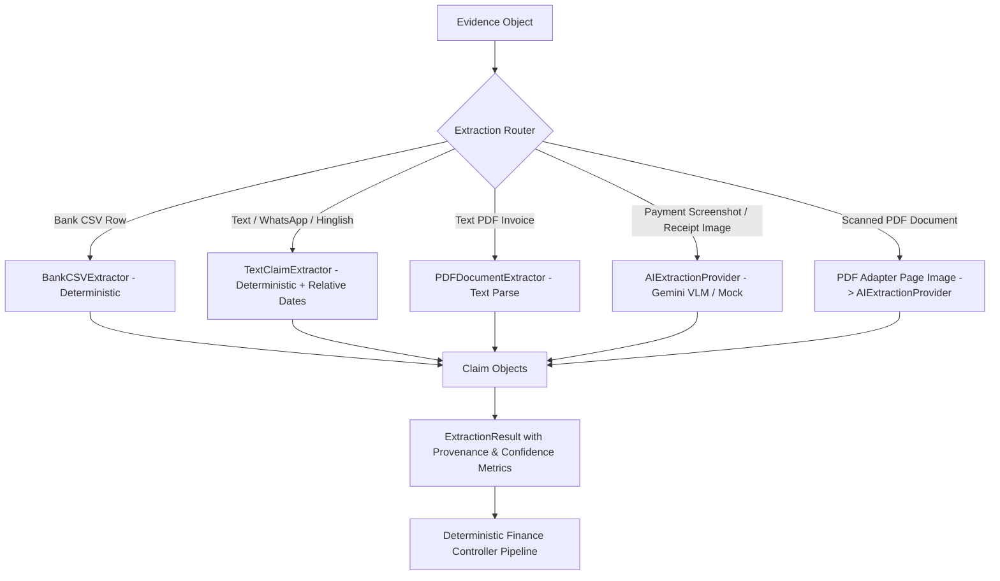

# VERITY Multimodal Evidence Extraction Subsystem

**Day 17: Real Multimodal Evidence Intelligence**  
*Razorpay AI Buildathon 2026 | Track: AI Finance Controller*

---

## 1. Core Principles & Architectural Boundary

The Extraction subsystem receives normalized `Evidence` objects and converts them into structured `Claim` objects representing the financial assertions made within the evidence.

### 🔒 Core Invariants
$$\mathbf{EVIDENCE \neq CLAIM \neq CONCLUSION}$$

1. **Extraction creates CLAIMS only**:
   - Extraction does **NOT** create `Transaction` ledger records.
   - Extraction does **NOT** match invoices to payments.
   - Extraction does **NOT** declare financial reconciliation conclusions.
2. **Anti-Hallucination Mandate**:
   - If an amount is not explicitly stated in evidence (e.g. *"I sent the money"*), `claimed_amount = None` (UNKNOWN).
   - If a counterparty or UTR reference is not explicitly stated, they remain `None`.
   - Missing fields are never fabricated or guessed.
3. **Deterministic-First Architecture**:
   - Structured data (Bank CSV rows) and clear text patterns are extracted with zero-cost deterministic parsers.
   - AI/VLM is reserved for ambiguous natural language, messy Hinglish, relative dates, invoice semantics, and multimodal vision (images, scanned PDFs).
4. **AI Never Overrides Financial Truth**:
   - AI/VLM extracts candidate structured claims from raw pixels and text.
   - Claims must flow through the deterministic pipeline (Entity Resolution -> Transaction Matching -> Deduplication -> Contradiction Detection -> Reconciliation) to establish Truth.

---

## 2. Extraction Pipeline Architecture



### 2.1 Bank CSV Extractor (`BankCSVExtractor`)
- **Input**: Normalized `Evidence` with `EvidenceModality.BANK_STATEMENT` and `EvidenceSourceType.BANK_CSV`.
- **Logic**:
  - Deposits/Credits -> `ClaimType.PAYMENT_RECEIVED`
  - Withdrawals/Debits -> `ClaimType.PAYMENT_SENT`
  - Extracts exact amounts, dates, narrations, payment rails (`UPI`, `NEFT`, `RTGS`, `IMPS`, `CHQ`), and reference UTRs.
  - Confidence: `1.0` (pure structured data).

### 2.2 Text & Multilingual Extractor (`TextClaimExtractor`)
- **Input**: `Evidence` with `EvidenceModality.MESSAGING_CHAT`, `RECEIPT`, `CASH_VOUCHER`.
- **Capabilities**:
  - **Currency patterns**: `₹`, `Rs.`, `INR`, `20k`, `1.5L`, `15 hazar`, `20000/-`, Devanagari digits (`२० हजार`), word numerals (`bees hazar`, `twenty thousand`).
  - **Directions**: Sent (`bhej diya`, `gpay kar diya`, `sent`, `payment kar diya`, `kalsiddini`, `chesanu`), Received (`received`, `credited`, `mil gaya`), Cash (`cash de diya`), Invoice (`invoice due`), Refund (`refund aa gaya`).
  - **Relative Date Resolution**: Resolves `yesterday`, `today`, `kal`, `parso`, and weekday names (`Tuesday`, `somvar`) against an explicit reference timestamp (`reference_timestamp` in context). When unanchored, preserves raw expression with `[date_uncertain]` marker.
  - **Position-Aware Amount Disambiguation**: When multiple monetary values appear in single evidence (e.g. *"₹25,000 sent to ABC yesterday but bank shows only 20k"*), selects the primary asserted amount based on textual position.
  - **Strict Anti-Hallucination**: *"I sent the money"* -> `claimed_amount = None`.

### 2.3 PDF Document Extractor (`PDFDocumentExtractor`)
- **Input**: Text-based or scanned PDF `Evidence`.
- **Logic**:
  - For text invoices: extracts invoice reference numbers (`#INV-2026-088`), total due amounts, dates, and billed-to parties.
  - For scanned PDFs: detects non-text documents (`is_scanned=True`), extracts embedded page images into base64 metadata, and delegates to vision-capable `AIExtractionProvider`.

### 2.4 Multimodal AI & VLM Provider (`AIExtractionProvider`)
- **Multimodal VLM Support**:
  - Accepts payment screenshots (`PNG`, `JPEG`, `WEBP`) via `image_bytes_b64` in Evidence metadata.
  - Accepts scanned PDF documents via `page_images_b64` in Evidence metadata.
  - Real Google Gemini integration using the official `google-genai` SDK (`gemini-3.6-flash`).
  - OpenAI-compatible endpoint support with base64 `image_url` payload construction.
- **Provider Architecture**:
  - `AIProviderType.MOCK`: Default for deterministic offline testing (zero network dependency).
  - `AIProviderType.GEMINI`: Live multimodal VLM inference via Google Gemini SDK.
  - `AIProviderType.OPENAI_COMPATIBLE`: Live HTTP REST inference with structured JSON mode.
- **Strict Schema Enforcement**: Constrains responses to the `StructuredClaimExtractionOutput` Pydantic model with strict domain boundary checks.
- **Safe Degradation**: Returns `ExtractionStatus.PROVIDER_UNAVAILABLE` when API keys are absent, preventing runtime crashes.

---

## 3. Extraction Result Model

```python
class ExtractionResult(BaseModel):
    evidence_id: str
    status: ExtractionStatus  # SUCCESS, PARTIAL_SUCCESS, NO_CLAIMS_FOUND, REQUIRES_VISION_OR_OCR, EXTRACTION_ERROR, PROVIDER_UNAVAILABLE
    claims: List[Claim]
    provider_name: str
    confidence_score: float  # 0.0 to 1.0
    warnings: List[ExtractionWarning]
    errors: List[str]
    metadata: Dict[str, Any]
```

---

## 4. Multimodal Transport & Data Safety

- **Image Bytes Transport**: Preserved inside `Evidence.metadata["image_bytes_b64"]` (base64 string) during ingestion.
- **Isolation**: Raw image bytes never enter financial ledger calculations or database serialization keys.
- **Provenance Integrity**: Content hash (`SHA-256`) is computed on raw bytes at ingestion, ensuring full auditability.

---

## 5. Verification & Test Categories

The extraction subsystem enforces 3 distinct verification states:

| Category | Description | Execution Guarantee |
|:---|:---|:---|
| **A. Mock Provider Tests** | Deterministic text parsing, schema validation, hallucination rejection, and mock AI fallbacks. | Always runs offline (CI/CD safe). |
| **B. Local Fixture Pipeline Tests** | Tests real PNG/JPEG payment screenshots and scanned PDF rendering through ingestion adapters. | Uses generated local test fixtures (`scripts/create_day17_fixtures.py`). |
| **C. Live Gemini Inference** | Live multimodal calls to Google Gemini API using `google-genai`. | Executed when `GEMINI_API_KEY` is present; marked `NOT RUN / BLOCKED` otherwise without failure. |

---

## 6. API Usage Examples

```python
from backend.extraction import ExtractionService
from backend.domain.evidence import Evidence, EvidenceModality, EvidenceSourceType
from datetime import date

service = ExtractionService()

# 1. Extract from WhatsApp Hinglish Evidence with Relative Date
ev_chat = Evidence(
    id="EVID-001",
    modality=EvidenceModality.MESSAGING_CHAT,
    source_type=EvidenceSourceType.WHATSAPP_EXPORT,
    source_name="whatsapp.txt",
    raw_payload="Bhai Rahul ko 20 hazar UPI kiya tha Tuesday",
)
result = service.extract_from_evidence(
    ev_chat,
    context={"reference_timestamp": date(2026, 8, 24)}
)
claim = result.claims[0]
print(f"Claim Type: {claim.claim_type.value}, Amount: ₹{claim.claimed_amount:,.2f}, Date: {claim.claimed_date}")
# Output: Claim Type: PAYMENT_SENT, Amount: ₹20,000.00, Date: 2026-08-18

# 2. Extract from Evidence lacking amount (Anti-Hallucination)
ev_vague = Evidence(
    id="EVID-002",
    modality=EvidenceModality.MESSAGING_CHAT,
    source_type=EvidenceSourceType.WHATSAPP_EXPORT,
    source_name="chat.txt",
    raw_payload="maine usko payment kar diya tha",
)
result_vague = service.extract_from_evidence(ev_vague)
print(f"Claim Type: {result_vague.claims[0].claim_type.value}, Amount: {result_vague.claims[0].claimed_amount}")
# Output: Claim Type: PAYMENT_SENT, Amount: None (UNKNOWN - Never Fabricated)
```
