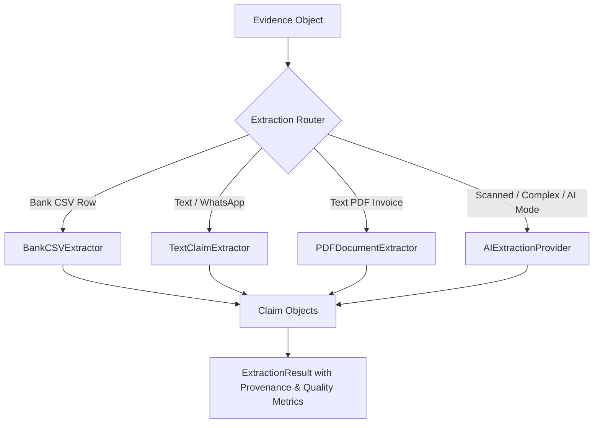

# VERITY Multimodal Evidence Extraction Subsystem

**Day 3 Milestone: Multimodal Claims Extraction**  
*Razorpay AI Buildathon 2026 | Track: AI Finance Controller*

---

## 1. Core Principles & Architectural Boundary

The Extraction subsystem receives normalized `Evidence` objects and converts them into structured `Claim` objects representing the financial assertions made within the evidence.

### 🔒 Core Invariants
$$\mathbf{EVIDENCE \neq CLAIM \neq CONCLUSION}$$

1. **Extraction creates CLAIMS only**:
   - Extraction does **NOT** create `Transaction` ledger records.
   - Extraction does **NOT** match invoices to payments.
   - Extraction does **NOT** declare financial reconciliation conclusions.
2. **Anti-Hallucination Mandate**:
   - If an amount is not explicitly stated in evidence (e.g. *"I sent the money"*), `claimed_amount = None` (UNKNOWN).
   - If a counterparty or UTR reference is not explicitly stated, they remain `None`.
   - Missing fields are never fabricated or guessed.
3. **Deterministic-First Architecture**:
   - Structured data (Bank CSV rows) and clear text patterns are extracted with zero-cost deterministic parsers.
   - AI is reserved for ambiguous natural language, invoice semantics, and multimodal vision.

---

## 2. Extraction Pipeline Architecture



### 2.1 Bank CSV Extractor (`BankCSVExtractor`)
- **Input**: Normalized `Evidence` with `EvidenceModality.BANK_STATEMENT` and `EvidenceSourceType.BANK_CSV`.
- **Logic**:
  - Deposits/Credits -> `ClaimType.PAYMENT_RECEIVED`
  - Withdrawals/Debits -> `ClaimType.PAYMENT_SENT`
  - Extracts exact amounts, dates, narrations, payment rails (`UPI`, `NEFT`, `RTGS`, `IMPS`, `CHQ`), and reference UTRs.
  - Confidence: `1.0` (pure structured data).

### 2.2 Text & Multilingual Extractor (`TextClaimExtractor`)
- **Input**: `Evidence` with `EvidenceModality.MESSAGING_CHAT`, `RECEIPT`, `CASH_VOUCHER`.
- **Capabilities**:
  - Currency patterns: `₹`, `Rs.`, `INR`, `20k`, `1.5L`, `15 hazar`, `20000/-`, Devanagari digits (`२० हजार`).
  - Directions: Sent (`bhej diya`, `gpay kar diya`, `sent`, `kalsiddini`, `chesanu`), Received (`received`, `credited`, `mil gaya`), Cash (`cash de diya`), Invoice (`invoice due`).
  - Multilingual support: English, Hinglish, Hindi, Marathi, Tamil, Telugu, Kannada, Bengali.
  - Strict anti-hallucination: *"I sent the money"* -> `claimed_amount = None`.

### 2.3 PDF Document Extractor (`PDFDocumentExtractor`)
- **Input**: Text-based or scanned PDF `Evidence`.
- **Logic**:
  - For text invoices: extracts invoice reference numbers (`#INV-2026-088`), total due amounts, dates, and billed-to parties.
  - For scanned PDFs: immediately signals `ExtractionStatus.REQUIRES_VISION_OR_OCR` without hallucinating fields.

### 2.4 AI Extraction Provider (`AIExtractionProvider`)
- **Provider-Independent**: Configurable via `AIProviderConfig` with environment variable API keys.
- **Strict Schema Enforcement**: Constrains responses to the `StructuredClaimExtractionOutput` Pydantic model.
- **Graceful Degradation**: Returns `ExtractionStatus.PROVIDER_UNAVAILABLE` when unconfigured, preventing crashes.

---

## 3. Extraction Result Model

```python
class ExtractionResult(BaseModel):
    evidence_id: str
    status: ExtractionStatus  # SUCCESS, PARTIAL_SUCCESS, NO_CLAIMS_FOUND, REQUIRES_VISION_OR_OCR, EXTRACTION_ERROR
    claims: List[Claim]
    provider_name: str
    confidence_score: float  # 0.0 to 1.0
    warnings: List[ExtractionWarning]
    errors: List[str]
    metadata: Dict[str, Any]
```

---

## 4. API Usage Examples

```python
from backend.extraction import ExtractionService
from backend.domain.evidence import Evidence, EvidenceModality, EvidenceSourceType

service = ExtractionService()

# 1. Extract from WhatsApp Evidence
ev_chat = Evidence(
    id="EVID-001",
    modality=EvidenceModality.MESSAGING_CHAT,
    source_type=EvidenceSourceType.WHATSAPP_EXPORT,
    source_name="whatsapp.txt",
    raw_payload="Bhai 20k GPay kar diya check kar lo",
)
result = service.extract_from_evidence(ev_chat)
claim = result.claims[0]
print(f"Claim Type: {claim.claim_type.value}, Amount: ₹{claim.claimed_amount:,.2f}, Rail: {claim.payment_method_hint}")
# Output: Claim Type: PAYMENT_SENT, Amount: ₹20,000.00, Rail: UPI

# 2. Extract from Evidence lacking amount (Anti-Hallucination)
ev_vague = Evidence(
    id="EVID-002",
    modality=EvidenceModality.MESSAGING_CHAT,
    source_type=EvidenceSourceType.WHATSAPP_EXPORT,
    source_name="chat.txt",
    raw_payload="I sent the money.",
)
result_vague = service.extract_from_evidence(ev_vague)
print(f"Claim Type: {result_vague.claims[0].claim_type.value}, Amount: {result_vague.claims[0].claimed_amount}")
# Output: Claim Type: PAYMENT_SENT, Amount: None (UNKNOWN)
```
