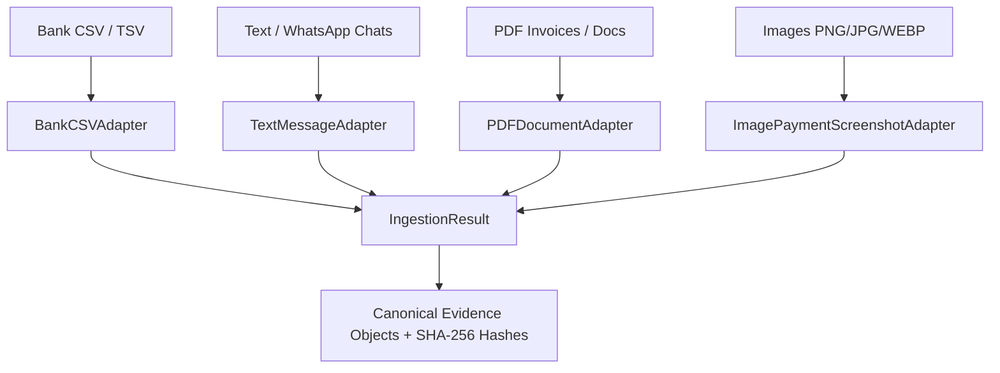

# VERITY Evidence Ingestion Subsystem

**Day 2 Milestone: Evidence Ingestion & Normalization**  
*Razorpay AI Buildathon 2026 | Track: AI Finance Controller*

---

## 1. Overview & Architectural Boundaries

The Evidence Ingestion subsystem serves as the entry gateway to VERITY. It ingests messy, heterogeneous financial artifacts from the physical and digital world and converts them into standardized, canonical `Evidence` domain objects with cryptographic integrity.

### 🔒 Core Invariant
$$\mathbf{EVIDENCE \neq CLAIM \neq CONCLUSION}$$

The Ingestion layer **ONLY** creates `Evidence` objects. It deliberately does **NOT**:
- Extract financial claims (*"Paid ₹20,000 via GPay"* remains uninterpreted raw evidence)
- Extract or instantiate `Transaction` ledger records
- Resolve counterparty identities
- Match transactions or calculate reconciliations
- Execute OCR or invoke Vision/LLM models

---

## 2. Ingestion Adapters & Modalities



### 2.1 Bank CSV Ingestion (`BankCSVAdapter`)
- **Supported Extensions**: `.csv`, `.tsv`
- **Output Modality**: `EvidenceModality.BANK_STATEMENT`
- **Source Type**: `EvidenceSourceType.BANK_CSV`
- **Features**:
  - Automatically identifies header aliases for Date (`Txn Date`, `Value Date`, `Posting Date`), Narration (`Description`, `Particulars`, `Remarks`), Amount (`Deposit`, `Withdrawal`, `Credit`, `Debit`), Reference (`UTR`, `RRN`, `Chq No`).
  - Converts each valid row into an individual `Evidence` object preserving original column dictionary and raw line representation.
  - Reports malformed rows as `IngestionError` items with exact 1-indexed row numbers without failing the entire batch (`PARTIAL_SUCCESS`).

### 2.2 Text / WhatsApp Chat Ingestion (`TextMessageAdapter`)
- **Supported Extensions**: `.txt`, `.log`, `.chat` (and direct string payloads)
- **Output Modality**: `EvidenceModality.MESSAGING_CHAT`
- **Source Type**: `EvidenceSourceType.WHATSAPP_EXPORT` / `SMS_TEXT`
- **Features**:
  - Full UTF-8 support for English, Hinglish (*"Bhai 20k GPay kar diya"*), Hindi (Devanagari), Tamil, Telugu, Kannada, Bengali.
  - Automatically parses standard WhatsApp multi-line export headers (`[DD/MM/YYYY, HH:MM] Sender: Message` and `DD/MM/YY, HH:MM - Sender: Message`) to produce timestamped, attributed `Evidence` items.
  - Lightweight heuristic language hint tagging (`en`, `hi`, `ta`, `kn`, `te`, `bn`, `hinglish`).

### 2.3 PDF Document Ingestion (`PDFDocumentAdapter`)
- **Supported Extensions**: `.pdf`
- **Output Modality**: `EvidenceModality.INVOICE`, `RECEIPT`, `BANK_STATEMENT`
- **Features**:
  - Extracts text streams using `pypdf`.
  - Distinguishes text-based digital PDFs from image-only / scanned PDFs (`metadata["is_scanned"] = True`).
  - Preserves page count, file size, and document metadata.

### 2.4 Image / Payment Screenshot Ingestion (`ImagePaymentScreenshotAdapter`)
- **Supported Extensions**: `.png`, `.jpg`, `.jpeg`, `.webp`
- **Output Modality**: `EvidenceModality.PAYMENT_SCREENSHOT`, `RECEIPT`, `CASH_VOUCHER`
- **Features**:
  - Validates image integrity and structure via Pillow.
  - Captures image dimensions (width, height), color mode, format, and file size.
  - Generates SHA-256 content hashes for tamper-evident provenance.

---

## 3. Ingestion Result & Error Taxonomy

Operations return a typed `IngestionResult` model:

| Status | Definition |
|---|---|
| `SUCCESS` | 100% of input files/rows converted into valid `Evidence` objects. |
| `PARTIAL_SUCCESS` | Some rows or files succeeded, while specific malformed rows were recorded as `IngestionError`s. |
| `INVALID_INPUT` | Input file/payload is empty, missing from disk, or has 0 parseable bytes. |
| `UNSUPPORTED_FORMAT` | File extension or MIME type is not supported by registered adapters. |
| `MALFORMED_DATA` | File structure or headers completely fail validation (e.g. corrupt PDF/image, unparseable CSV header). |

---

## 4. API Usage Examples

### Single File Ingestion:
```python
from backend.ingestion import IngestionService

service = IngestionService()
result = service.ingest_file("data/samples/day2/bank_statement.csv")
print(f"Status: {result.status}, Evidence Count: {len(result.evidence_items)}")
```

### Direct Text / WhatsApp Ingestion:
```python
result = service.ingest_text(
    "Bhai 20k GPay kar diya check kar lo",
    source_name="whatsapp_chat",
)
ev = result.evidence_items[0]
print(f"ID: {ev.id}, Modality: {ev.modality.value}, Hash: {ev.content_hash}")
```

### Batch Ingestion over Directory:
```python
result = service.ingest_batch("data/samples/day2/")
for ev in result.evidence_items:
    print(f"Evidence {ev.id}: {ev.modality.value} ({ev.source_name})")

for err in result.errors:
    print(f"Error in {err.source_name} [Row {err.row_index}]: {err.message}")
```
