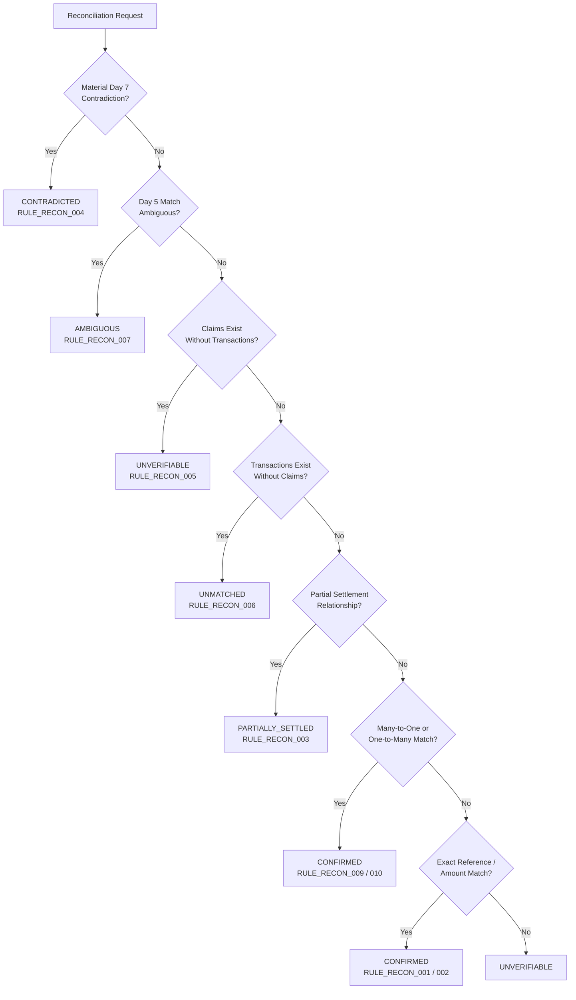

# VERITY Financial Reconciliation Subsystem

**Day 8 Milestone: Deterministic Financial Reconciliation & Truth Reconstruction**  
*Razorpay AI Buildathon 2026 | Track: AI Finance Controller*

---

## 1. Core Principles & Philosophy

The Financial Reconciliation subsystem is the final deterministic reasoning layer of VERITY. It consumes the structured outputs of Days 1–7 and synthesizes explainable, mathematically verified financial conclusions.

### 🔒 Core Invariant: Multi-Stage Deterministic Pipeline
$$\mathbf{Evidence \to Claim \to Entity \to Match\ Relationship \to Deduplication\ Group \to Discrepancy \to Financial\ Reconciliation}$$

1. **Deterministic Truth Without LLM Hallucination**:
   - Financial truth is synthesized strictly via deterministic rules, verified ledger transactions, and tamper-evident provenance DAGs.
2. **Zero False Confirmation Policy**:
   - High similarity scores or partial matches **never** override hard safety rules, entity conflicts, or material Day 7 contradictions.
3. **Zero Double-Counting**:
   - Deduplicated evidence artifacts across Bank CSV, WhatsApp, Screenshot, and Invoice modalities are mapped to a single financial event, guaranteeing exact settlement calculations.
4. **Monetary Invariants**:
   - For confirmed and partially settled cases:
     $$\mathbf{Matched\ Amount + Outstanding\ Amount = Expected\ Amount}$$
5. **Ambiguity Preservation**:
   - Competing candidates or unresolvable ambiguities are explicitly reported as `AMBIGUOUS` rather than arbitrarily choosing a path.

---

## 2. Reconciliation Status Taxonomy

| Status | Definition | Accounting Action |
|---|---|---|
| `CONFIRMED` | The obligation and settlement are 100% supported by matching evidence, compatible entity, compatible date, and no material unresolved contradiction. | Fully settled (`outstanding_amount = 0.0`). |
| `PARTIALLY_SETTLED` | A valid Day 5 `PARTIAL` relationship establishes that only part of the expected amount has been settled. | Partial settlement recognized (`outstanding_amount = expected - matched`). |
| `CONTRADICTED` | Material Day 7 contradictions (`AMOUNT_MISMATCH`, `REFERENCE_MISMATCH`, `ENTITY_MISMATCH`, `DIRECTION_MISMATCH`, `CONFLICTING_CLAIMS`) demonstrate that evidence disagrees. | Obligation remains unsettled (`outstanding_amount = expected`). |
| `UNVERIFIABLE` | Insufficient evidence to determine whether the financial claim is true or false (e.g. uncorroborated text claim or missing amount). | No ledger backing (`matched_amount = 0.0`). |
| `AMBIGUOUS` | Multiple plausible reconciliation paths exist and cannot safely be distinguished. | Flagged for human review. |
| `UNMATCHED` | A verified ledger transaction exists without a corresponding invoice or obligation. | Unmatched credit / debit (`matched_amount = transaction_amount`). |

---

## 3. Deterministic Decision Hierarchy



---

## 4. Confidence Scoring Matrix

Confidence scores are deterministic and explainable:

| Signal / Condition | Weight / Impact |
|---|---|
| `EXACT_REFERENCE` (Matching UTR / RRN) | `+0.40` |
| `EXACT_AMOUNT` (Matching currency total) | `+0.30` |
| `EXACT_ENTITY` (Matching resolved counterparty) | `+0.20` |
| `MATCHED_RELATIONSHIP` (Day 5 verified match) | `+0.15` |
| `MULTIPLE_INDEPENDENT_EVIDENCE` (Cross-modal support) | `+0.10` |
| `DATE_COMPATIBILITY` (Within settlement window) | `+0.10` |
| `NO_CONTRADICTIONS` (Zero unresolved discrepancies) | `+0.05` |
| `PARTIAL_RELATIONSHIP` | Base `0.90` (or `0.95` with exact entity) |
| `AMBIGUITY` | Fixed `0.60` |
| `UNVERIFIABLE` | Fixed `0.40` |

---

## 5. API Usage Example

```python
from backend.reconciliation import ReconciliationService, ReconciliationConfig

service = ReconciliationService(config=ReconciliationConfig(date_tolerance_days=7))

# Reconcile complete multimodal batch
batch_result = service.reconcile_all(
    claims=claims,
    transactions=transactions,
    evidence_items=evidence_items,
    deduplication_groups=deduplication_groups,
    match_relationships=match_relationships,
    discrepancies=discrepancies,
    claim_entity_map=claim_entity_map,
)

print(f"Total Reconciled Amount: INR {batch_result.total_reconciled_amount:,.2f}")
print(f"Total Outstanding Amount: INR {batch_result.total_outstanding_amount:,.2f}")

for res in batch_result.results:
    print(f"Event: {res.event_id} | Status: {res.status.value} | Matched: {res.matched_amount} | Out: {res.outstanding_amount}")
    print(f"Explanation: {res.explanation}")
```
