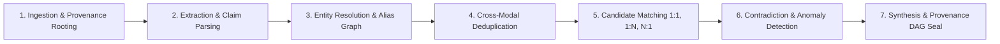

# VERITY Reconciliation Pipeline Lifecycle

This document describes the end-to-end multi-stage reconciliation pipeline that transforms messy, fragmented financial evidence into verified financial reality.

---

## 1. Pipeline Stages

### Stage 1: Ingestion & Provenance Rooting
- Ingests raw inputs (Bank CSVs, Invoices, WhatsApp export text, Payment screenshots).
- Instantiates `Evidence` domain objects.
- Generates SHA-256 cryptographic fingerprints.
- Registers root `EVIDENCE` nodes in the `ProvenanceTracker`.

### Stage 2: Extraction & Claim Parsing
- Extracts structured financial entities:
  - Asserted `Claim` objects (amount, date, party hint, reference hint).
  - Verified `Transaction` objects (from bank statements and gateway feeds).
- Attaches confidence scores and links each claim to its parent evidence item.

### Stage 3: Entity Resolution & Alias Graph
- Normalizes counterparty names, aliases, and trading styles.
- Matches against official tax identifiers (GSTIN, PAN) and payment handles (UPI VPAs, phone numbers).
- Produces canonical `Entity` associations.

### Stage 4: Cross-Modal Deduplication
- Detects when the same underlying transaction is evidenced across multiple channels (e.g. a WhatsApp screenshot showing a ₹15,000 payment with UTR `408219381920` and a bank CSV line with the same UTR).
- Groups redundant evidence to prevent double-counting in ledger summaries.

### Stage 5: Candidate Transaction Matching
- Evaluates match topologies:
  - **1:1 Matches**: Single invoice matched with single transaction.
  - **1:N (One-to-Many)**: Single bulk payment settling multiple outstanding invoices.
  - **N:1 (Many-to-One)**: Multiple installment payments (advance + milestones) settling one invoice.
  - **Partial Payments**: Verified payment amount is less than invoice total; computes exact outstanding balance.

### Stage 6: Contradiction & Discrepancy Detection
- Compares claims against actual bank transactions:
  - Claimed paid vs actual received amounts.
  - Claims asserting payment where bank statements show bounced or failed transactions.
  - Unverifiable cash claims lacking bank deposit slips or signed vouchers.
- Generates structured `Discrepancy` records with severity ratings (`INFO`, `WARNING`, `ERROR`, `CRITICAL`).

### Stage 7: Synthesis & Provenance DAG Seal
- Constructs the immutable `ReconciliationRecord` conclusion with status (`CONFIRMED`, `PARTIAL`, `DUPLICATE`, `CONTRADICTED`, `UNVERIFIABLE`, `AMBIGUOUS`).
- Seals the end-to-end `AuditTrail` DAG so every number can be audited back to the raw source bytes.
