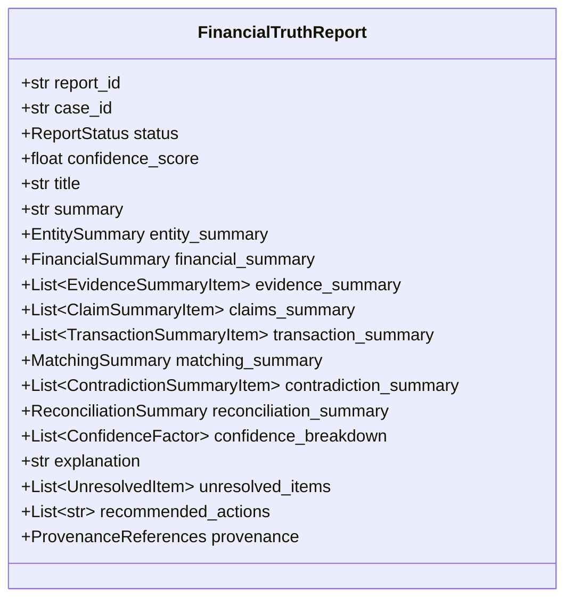

# VERITY Financial Truth Reporting & Explainability Subsystem

**Day 9 Milestone: Explainable Financial Truth & Case Reporting**  
*Razorpay AI Buildathon 2026 | Track: AI Finance Controller*

---

## 1. Core Principles & Philosophy

The Reporting and Explainability subsystem transforms the verified outputs of Days 1–8 into a structured, human-readable **Financial Truth Report** (`FinancialTruthReport`).

### 🔒 Core Invariant: Explainability Without Hallucination
$$\mathbf{Evidence \neq Claim \neq Transaction \neq Reconciliation \neq Explanation}$$

1. **Deterministic Explanation Synthesis**:
   - Every paragraph, summary sentence, factor impact, and action item is generated deterministically from structured facts.
   - **Zero LLM hallucination**: Missing values are presented as `"Unknown"` or `"Not provided"` and never invented.
2. **Strict Provenance DAG Preservation**:
   - Every report retains explicit identifiers linking back to root `Evidence`, `Claim`, `Entity`, `Transaction`, `MatchRelationship`, `DeduplicationGroup`, `Discrepancy`, and `ReconciliationResult` nodes.
3. **Confidence Transparency**:
   - Directly explains the positive and negative signals that led to the calculated confidence score (e.g. `+ EXACT_REFERENCE`, `+ EXACT_AMOUNT`, `- AMOUNT_MISMATCH`).
4. **Actionable Human-Review Guidance**:
   - Produces deterministic, context-specific next steps for finance controllers and accounting operators.

---

## 2. Financial Truth Report Schema



---

## 3. Example Rendered Text Report

```text
============================================================
VERITY FINANCIAL TRUTH REPORT
============================================================
Case ID      : CASE-001
Report ID    : REP-A1B2C3D4
Status       : CONFIRMED
Confidence   : 100%
Title        : Confirmed Settlement of INR 35,000.00 for Rahul Kumar

------------------------------------------------------------
COUNTERPARTY ENTITY
------------------------------------------------------------
Name         : Rahul Kumar
Entity ID    : ENT-001
PAN          : ABCDE1234F
UPI VPA      : rahul@oksbi

------------------------------------------------------------
FINANCIAL ACCOUNTING SUMMARY
------------------------------------------------------------
Claimed / Expected Amount  : INR 35,000.00
Verified Ledger Matched    : INR 35,000.00
Outstanding Balance        : INR 0.00

------------------------------------------------------------
SUPPORTING EVIDENCE (2 items)
------------------------------------------------------------
  * [INVOICE] inv_001.pdf: INVOICE via ZOHO_INVOICE
  * [BANK_STATEMENT] bank.csv: BANK_STATEMENT via BANK_CSV

------------------------------------------------------------
TRANSACTION MATCHING TOPOLOGY
------------------------------------------------------------
Pattern      : ONE_TO_ONE
Status       : MATCHED (Score: 1.00)
Signals      : EXACT_REFERENCE, EXACT_AMOUNT_MATCH, EXACT_ENTITY_MATCH

------------------------------------------------------------
CONTRADICTIONS & DISCREPANCIES (0)
------------------------------------------------------------
  * No unresolved contradictions detected.

------------------------------------------------------------
EXPLANATION OF FINANCIAL TRUTH
------------------------------------------------------------
Full financial reconciliation was confirmed for Rahul Kumar. The expected
amount of INR 35,000.00 was corroborated by bank ledger transaction
(408219381920) matching the claim. Evidence provenance is strengthened by
2 cross-modal artifacts (BANK_STATEMENT, INVOICE). No material discrepancies
or conflicting signals were detected.

------------------------------------------------------------
CONFIDENCE FACTORS
------------------------------------------------------------
  + EXACT_REFERENCE: Explicit bank reference (UTR/RRN) matched identically across evidence sources.
  + EXACT_AMOUNT: Monetary amounts matched exactly without numeric discrepancy.
  + EXACT_ENTITY: Counterparty identity verified against canonical entity registry.
  + MULTIPLE_EVIDENCE_SOURCES: Corroborated across 2 independent multimodal evidence items.

------------------------------------------------------------
RECOMMENDED ACTIONS
------------------------------------------------------------
  -> No immediate action required. Financial settlement is verified.

------------------------------------------------------------
PROVENANCE & AUDIT TRAIL REFERENCES
------------------------------------------------------------
Evidence IDs       : EVID-01, EVID-01-BANK
Claim IDs          : CLM-01
Transaction IDs    : TXN-01
Discrepancy IDs    : None
Reconciliation ID  : REC-01
============================================================
```

---

## 4. API Usage Example

```python
from backend.reporting import ReportingService

service = ReportingService()

# Build report from reconciliation output and context
report = service.build_report(
    reconciliation_result=recon_result,
    claims=claims,
    transactions=transactions,
    evidence=evidence,
    entities=entities,
    match_relationships=match_relationships,
    deduplication_groups=deduplication_groups,
    discrepancies=discrepancies,
    case_id="INV-2026-088",
)

# Render formats
text_report = service.render_text_report(report)
json_report = service.render_json_report(report)

print(text_report)
```
