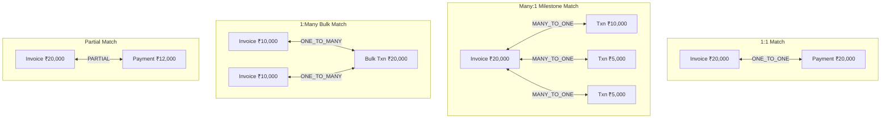

# VERITY Transaction Matching Subsystem

**Day 5 Milestone: Deterministic Multi-Signal Transaction Matching**  
*Razorpay AI Buildathon 2026 | Track: AI Finance Controller*

---

## 1. Core Principles & Philosophy

The Transaction Matching subsystem evaluates extracted `Claim` assertions, verified `Transaction` ledger records, and resolved `Entity` identities to establish candidate **Match Relationships**.

### 🔒 Core Invariant: Match $\neq$ Reconciliation Conclusion
$$\mathbf{Evidence \to Claim \to Entity \to Match\ Relationship \to Future\ Reconciliation}$$

1. **Matching Establishes Relationships, NOT Financial Truth**:
   - Matching identifies which financial records are plausible candidates for the same underlying financial event.
   - Matching does **NOT** declare final reconciliation conclusions (`CONFIRMED`, `UNVERIFIABLE`), contradiction outcomes, or outstanding balances.
2. **Zero False Match Policy**:
   - Equal amounts and identical dates alone are **never** treated as sufficient proof to merge records across different entities.
   - Competing candidates with close scores strictly preserve `AMBIGUOUS`.
   - Contradictory signals (e.g. matching amount but conflicting entity) strictly output `CONFLICTING`.
3. **Bounded Search Complexity**:
   - Multi-record combination search is strictly bounded ($\le 5$ candidate items) to prevent combinatorial explosion on large business datasets.
4. **100% Deterministic & Explainable**:
   - Zero opaque ML models or LLMs used for financial matching. Every score provides a human-readable signal breakdown.

---

## 2. Supported Match Topologies



| Topology | `MatchRelationshipType` | Description |
|---|---|---|
| **1-to-1** | `ONE_TO_ONE` | 1 Invoice / Claim $\leftrightarrow$ 1 Payment / Transaction of equal value. |
| **Many-to-1** | `MANY_TO_ONE` | $N$ milestone transactions sum up to settle 1 Invoice (e.g. ₹10k + ₹5k + ₹5k = ₹20k). |
| **1-to-Many** | `ONE_TO_MANY` | 1 bulk settlement transaction covers $N$ individual invoices (e.g. ₹20k = ₹10k + ₹10k). |
| **Partial** | `PARTIAL` | Partial payment relationship where $\text{Transaction} < \text{Invoice}$. |

---

## 3. Signal Scoring Matrix

| Signal | Weight | Description |
|---|---|---|
| `EXACT_REFERENCE` | `1.00` | Exact match on UTR / RRN (12 digits), NEFT reference, or cheque #. |
| `EXACT_INVOICE_NUMBER` | `1.00` | Payment narration explicitly cites invoice number (`INV-2026-088`). |
| `EXACT_ENTITY_MATCH` | `0.90` | Resolved `Entity.id` matches on both claim and transaction. |
| `EXACT_AMOUNT_MATCH` | `0.80` | Amounts match exactly within rounding tolerance. |
| `SUM_AMOUNT_MATCH` | `0.80` | Sum of candidate subset equals target amount. |
| `DATE_PROXIMITY` | `0.70` | Dates fall within configurable window ($\le \text{date\_tolerance\_days}$). |
| `PAYMENT_METHOD_MATCH` | `0.60` | Payment rail compatibility (UPI $\leftrightarrow$ UPI, NEFT $\leftrightarrow$ NEFT). |
| `NARRATION_KEYWORD_MATCH` | `0.55` | Counterparty name tokens identified in statement narration. |
| `PARTIAL_AMOUNT_MATCH` | `0.50` | Settlement amount is strictly less than invoice expected total. |

---

## 4. API Usage Examples

```python
from backend.domain.claim import Claim, ClaimType
from backend.domain.transaction import Transaction, TransactionDirection
from backend.transaction_matching import TransactionMatcher, MatchConfig

matcher = TransactionMatcher(config=MatchConfig(date_tolerance_days=7))

# 1. 1-to-1 Match
claim = Claim(
    id="CLM-01",
    evidence_id="EVID-01",
    claim_type=ClaimType.INVOICE_ISSUED,
    claimed_amount=35000.0,
    reference_id_hint="408219381920",
)
txn = Transaction(
    id="TXN-01",
    amount=35000.0,
    direction=TransactionDirection.CREDIT,
    bank_reference="408219381920",
)

result = matcher.match(claims=[claim], transactions=[txn])
rel = result.relationships[0]
print(f"Topology: {rel.relationship_type.value}, Status: {rel.status.value}, Score: {rel.score}")
# Output: Topology: ONE_TO_ONE, Status: MATCHED, Score: 1.0

# 2. Ambiguity Preservation (Multiple Equal Payments)
claim_amb = Claim(id="CLM-02", evidence_id="E2", claim_type=ClaimType.INVOICE_ISSUED, claimed_amount=25000.0)
txns_amb = [
    Transaction(id="T-A", amount=25000.0, direction=TransactionDirection.CREDIT),
    Transaction(id="T-B", amount=25000.0, direction=TransactionDirection.CREDIT),
]
result_amb = matcher.match(claims=[claim_amb], transactions=txns_amb)
print(f"Status: {result_amb.relationships[0].status.value}")
# Output: Status: AMBIGUOUS (Human review required)
```
